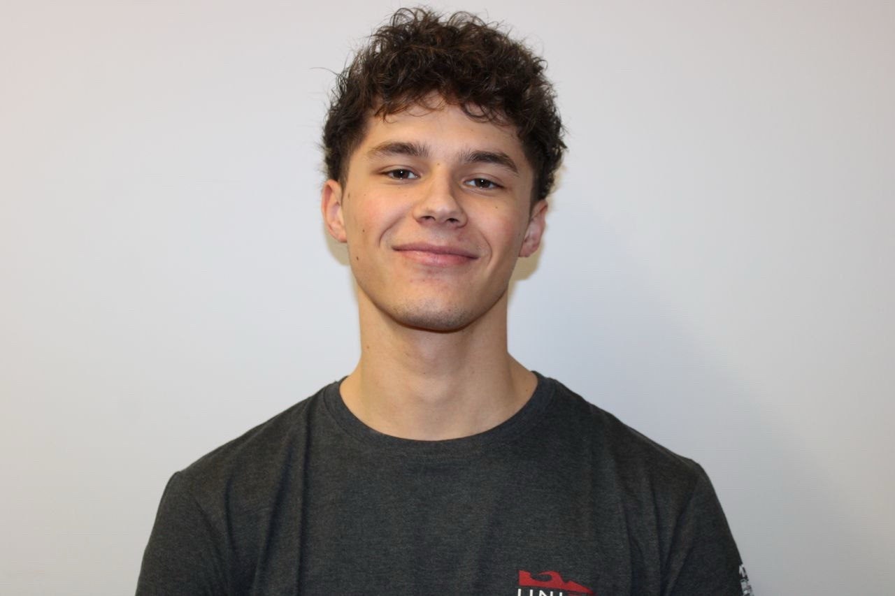

<html lang="it">
<head>
<meta charset="UTF-8"/>
<meta name="viewport" content="width=device-width, initial-scale=1.0"/>
<title>Lancelot — AI Automation Engineer</title>
<link href="https://fonts.googleapis.com/css2?family=Barlow+Condensed:wght@300;400;600;700;900&family=Barlow:wght@300;400;500;600&display=swap" rel="stylesheet"/>

</head>
<body>

<nav>
  
Lancelot

  <ul class="nav-links">
    <li><a href="#bio">Chi Sono</a></li>
    <li><a href="#pain">Il Problema</a></li>
    <li><a href="#solution">La Soluzione</a></li>
    <li><a href="#techstack">Stack</a></li>
    <li><a href="#links">Connect</a></li>
  </ul>
</nav>

<!-- HERO -->
<section id="hero">
  

    

      
Bridge Builder · AI × Industrial Automation

      <h1 class="hero-h1">
        Robotica 
        Intuitiva 
        come uno 
        Smartphone
      </h1>
      

        Libero i Plant Manager dall'incubo del downtime e dalla schiavitù del codice legacy. Trasformo fabbriche rigide in ecosistemi autonomi — abbattendo i tempi di sviluppo di un ordine di grandezza.
      

      

        <a href="#links" class="btn-lime">
          <svg width="14" height="14" viewBox="0 0 24 24" fill="none" stroke="currentColor" stroke-width="2.5"><line x1="5" y1="12" x2="19" y2="12"/><polyline points="12 5 19 12 12 19"/></svg>
          Inizia la Conversazione
        </a>
        <a href="#bio" class="btn-outline">Chi Sono</a>
      

    

    

      

        

AI

KRL→NL

        
PLC

ML

IoT

        

RUL

OPC

5.0

        

SCADA

HMI

        
Edge

AGI

Cobot

      

      
−73%Downtime ridotto

      
10×Velocità sviluppo

    

  

</section>

<!-- BIO -->
<section id="bio">
  

    

      
Chi Sono — Il Bridge Builder

      <h2 class="sec-h2">Dall'Officina al Business</h2>
    

    

      

        

          <!--
            PER AGGIUNGERE LA TUA FOTO:
            Sostituisci il blocco .bio-photo-placeholder qui sotto con:
            
            Assicurati che la foto sia nella stessa cartella del file HTML.
          -->
          
            <svg width="48" height="48" viewBox="0 0 24 24" fill="none" stroke="currentColor" stroke-width="1">
              <path d="M20 21v-2a4 4 0 0 0-4-4H8a4 4 0 0 0-4 4v2"/>
              <circle cx="12" cy="7" r="4"/>
            </svg>
            Carica qui la tua foto
            240×240px consigliato
          

          

          

        

        
Trevisi Matteo

        
Automation Engineer · AI Bridge Builder

      

      

        

          "Ho smesso di guardare solo ai bit e ai bulloni per guardare al valore di business."
        

        

          Sono un Ingegnere dell'Automazione che ha smesso di guardare solo ai bit e ai bulloni per guardare al valore di business. Mi definisco un 'Bridge Builder' tra l'Intelligenza Artificiale Generativa e la meccanica industriale.
        

        

          Il mio obiettivo è trasformare fabbriche rigide in ecosistemi autonomi, usando il #VIBECODING per abbattere i tempi di sviluppo e i costi di integrazione.
        

        

          Industria 5.0
          #VibeCoding
          Generative AI
          Robotica Industriale
          PLC / SCADA
          Machine Learning
        

      

    

</section>

<!-- PAIN -->
<section id="pain">
  

    

      
Il Problema — Prima del Mio Intervento

      <h2 class="sec-h2">La Fabbrica Ostaggio di Sé Stessa</h2>
    

    

      

        
47h

        
Linee Ferme

        
Un guasto non previsto blocca l'intera produzione. Ogni ora costa migliaia di euro e nessuno sa quando si riprende.

      

      

        
0

        
Programmatori Reperibili

        
KRL, RAPID, Structured Text — linguaggi proprietari che richiedono anni di formazione e specialisti introvabili sul mercato.

      

      

        
91%

        
Dati Sprecati

        
I sensori raccolgono terabyte di dati operativi che dormono su server locali, mai analizzati, mai trasformati in valore.

      

      

        
∞

        
Stress Operativo

        
Il Plant Manager vive nel terrore del prossimo fermo. Le decisioni vengono prese sull'onda dell'emergenza, non dei dati.

      

    

  

</section>

<!-- SOLUTION -->
<section id="solution">
  

    

      
La Soluzione — Dopo il Mio Intervento

      <h2 class="sec-h2">Tre Leve. Un Sistema Integrato.</h2>
    

    

      

        

          <svg width="24" height="24" viewBox="0 0 24 24" fill="none" stroke="currentColor" stroke-width="1.5"><path d="M21 15a2 2 0 0 1-2 2H7l-4 4V5a2 2 0 0 1 2-2h14a2 2 0 0 1 2 2z"/></svg>
        

        
Zero Skill Gap

        
Natural Language Interfaces

        
Dimentica KRL e RAPID. I tuoi operatori interagiscono con i robot in italiano, attraverso interfacce linguistiche che traducono l'intenzione in codice macchina. Zero formazione specialistica. Zero dipendenza da integratori esterni.

      

      

        

          <svg width="24" height="24" viewBox="0 0 24 24" fill="none" stroke="currentColor" stroke-width="1.5"><path d="M22 12h-4l-3 9L9 3l-3 9H2"/></svg>
        

        
Predictive Peace

        
Algoritmi Predittivi

        
I modelli ML analizzano vibrazione, temperatura e corrente 24/7 e stimano il Remaining Useful Life di ogni componente critico. Ricevi l'alert 12 giorni prima del guasto — non dopo. Da reattivo a proattivo.

      

      

        

          <svg width="24" height="24" viewBox="0 0 24 24" fill="none" stroke="currentColor" stroke-width="1.5"><polyline points="17 1 21 5 17 9"/><path d="M3 11V9a4 4 0 0 1 4-4h14"/><polyline points="7 23 3 19 7 15"/><path d="M21 13v2a4 4 0 0 1-4 4H3"/></svg>
        

        
Agile Reconfiguration

        
Setup in Minuti, non Giorni

        
Con architetture modulari e interfacce No-Code, il reconfiguring di una cella robotica passa da 3 giorni a 40 minuti. La flessibilità che il mercato richiede, senza il caos che temevi.

      

    

  

</section>

<!-- TECH STACK -->
<section id="techstack">
  

    

      
Tech Stack & #VibeCoding

      <h2 class="sec-h2">Come Costruisco 10× più Veloce</h2>
    

    

      

        

          
Claude

          
AI Architecture Partner

          
Progettazione di algoritmi, refactoring di codice legacy e generazione di documentazione tecnica in tempo reale.

        

        

          
Cursor

          
AI-Powered IDE

          
Sviluppo di logiche PLC e script Python con autocompletamento contestuale e review del codice assistita da LLM.

        

        

          
Python

          
ML & Data Pipeline

          
scikit-learn, PyTorch e pandas per i modelli predittivi. FastAPI per esporre le inferenze ai sistemi SCADA via REST/OPC-UA.

        

        

          
Miro

          
System Design Canvas

          
Architetture di sistema, Business Model Canvas e workshop di co-design con il cliente in un unico spazio collaborativo.

        

      

      

        
#VibeCoding

        
Il VibeCoding non è scrivere codice con l'AI. È un dialogo iterativo tra expertise ingegneristica e intelligenza generativa — dove l'AI amplifica il pensiero, non lo sostituisce.

        
Prototipo in ore ciò che richiederebbe settimane. Ogni output viene validato con rigore IEC, ma il ritmo è quello di una startup.

        

          
$ ai-eng init --project predictive_maint

          
✓ Dataset sensori caricato (4.2GB)

          
✓ Feature engineering: 42 features estratte

          
✓ LSTM addestrato → accuracy: 97.3%

          
$ deploy --env prod --target scada

          
✓ OPC-UA bridge attivo

          
⚠ Alert: Motore_03 RUL = 847h

          
$ # ↑ Tutto in 4 ore di lavoro

          
$ 

        

      

    

  

</section>

<!-- LINKS -->
<section id="links">
  

    

      
Connect — Parliamoci

      <h2 class="sec-h2">Due Porte. Un Obiettivo.</h2>
    

    

      <a href="https://www.linkedin.com/in/matteotrevisi/" target="_blank" class="link-card reveal reveal-d1">
        
01

        
Profilo Professionale

        
Il Mio Hammer su LinkedIn

        
Il mio track record, i progetti industriali, le competenze certificate e le riflessioni sul futuro dell'Industria 5.0.

        

          Visita il Profilo
          <svg width="14" height="14" viewBox="0 0 24 24" fill="none" stroke="currentColor" stroke-width="2.5"><line x1="5" y1="12" x2="19" y2="12"/><polyline points="12 5 19 12 12 19"/></svg>
        

      </a>
      <a href="https://miro.com/welcomeonboard/QlFvNXRUa1BPZEsyTmdUSGYrWHFwK05wN2IyZXl1dnhiQW5pM3ZQZlRWeGdnZy8wUm9ydzlja2tjdmk2YTIrbW9Ec0IvbVAxQklMNHFEeUZBOUloazVoTHNHSE9RNFVlNzhucXZWZVRhcW50WEplTkwwa05DTG9INERheWRXQk1yVmtkMG5hNDA3dVlncnBvRVB2ZXBnPT0hdjE=?share_link_id=573611647287" target="_blank" class="link-card reveal reveal-d2">
        
02

        
Business Model Canvas

        
La Strategia Integrale su Miro

        
Il Business Model Canvas completo, la value proposition mappata e i percorsi di trasformazione per le PMI manifatturiere.

        

          Apri la Board
          <svg width="14" height="14" viewBox="0 0 24 24" fill="none" stroke="currentColor" stroke-width="2.5"><line x1="5" y1="12" x2="19" y2="12"/><polyline points="12 5 19 12 12 19"/></svg>
        

      </a>
    

  

</section>

<footer>
  
© 2025 — Lancelot · Ingegnere dell'Automazione AI-Driven

  
Industria 5.0 Ready

</footer>

</body>
</html>
